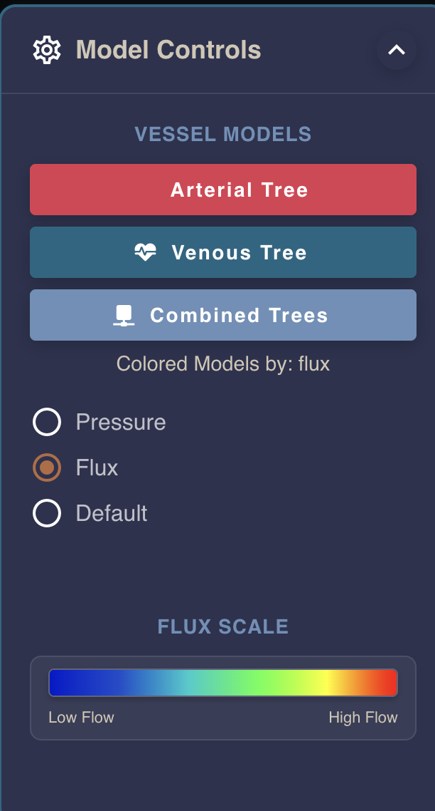
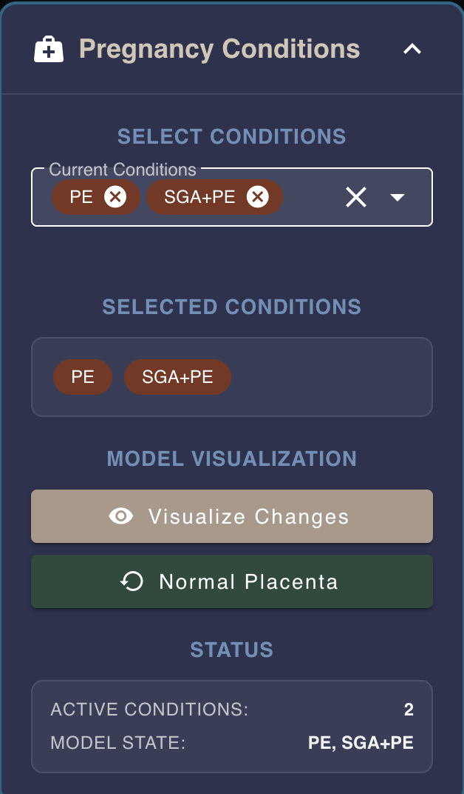

How to control the model
========================

At the right side of the app, there is a panel controls, click the arrow button to open the panel.

1. Vessel Models
---------------

You can see there are three buttons:

- Arterial Tree
- Venous Tree
- Combined Trees

Click the button to load the different models. The model will be loaded in the center of the app accordingly, the Combined Trees is the combination of arterial and venous trees.

2. Color Mapping
----------------

Under the model, there is a color mapping scale, which is used to show the color mapping of the pressure or flux.
When click the "Pressure", the color mapping will be the pressure, when click the "Flux", the color mapping will be the flux.
The default means that the color of the arterial vessels is red, and the color of the venous vessels is blue.

3. Condition Control
-------------------

Click the arrow below to open the dropdown menu where users can select their current pregnancy condition.
After making a selection, click "Visualize Changes" to see the relationship between their condition and placental changes (or to see if there are no changes).
Click "Normal Placenta" to return the model to its original state, allowing users to compare their condition with a standard placenta.
The "Status" section at the bottom will display a brief description of their condition.

**Note: Currently this section only shows the selection functionality and has not yet been integrated with the model for interaction.**

4. Waveform
----------

This section will display the changes corresponding to the user's selected condition over time. 