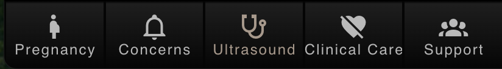

The Left Panel
==============

**Location**: ``frontend/components/navigation/LeftPane.vue``

**Purpose**: ``LeftPanel`` is the functional panel on the left side of the main application interface. It dynamically displays different content and interactive tools based on the current route.

**Definition**: The tabs and the content are defined in the ``frontend/assets/data`` file.

Main Features
------------

* Displays the topic interaction panel (``Panel``) when the route is ``slug`` (i.e., topic content page), including tools like pregnancy condition selectors and ultrasound metrics tools.

* Displays the About page (``Support``) when the route is ``about``. At this page, the left part function as a navigation bar, and the right part is the main content, user can access the support materials.

Main Tabs
---------

1. **Pregnancy**

   - **Body Changes**: Information about physical changes during pregnancy
   - **Placenta Roles**: Understanding the placenta's functions
   - **Baby Health**: How healthcare providers monitor fetal health

2. **Concerns**

   - **Fetal Growth**: Information about reduced fetal growth
   - **Birth**: How pregnancy issues affect birth plans
   - **Cares**: Post-birth care requirements

3. **Ultrasound - The Home Page**

   - Understanding ultrasound scan results. When user click the "Ultrasound" tab / or access the home page, the left panel will display the ultrasound related information.

   - When user scroll down, there will be 4 cards, including "What is an ultrasound?" (for example, as shown in the image below), "Ultrasound waveforms", "Detecting Pregnancy Concerns" and a interactive tool for ultrasound waveform. By clicking the card, user can access the corresponding page with more detailed information.

   .. image:: images/what_ultrasound.png
      :alt: What is an ultrasound?
      :align: center

4. **Clinical Care**

   - **Midwife Lead Care**: Midwife-led care pathways
   - **When Care Changes**: How care pathways may change during pregnancy

5. **Support**

   - Access to comprehensive support services and resources 